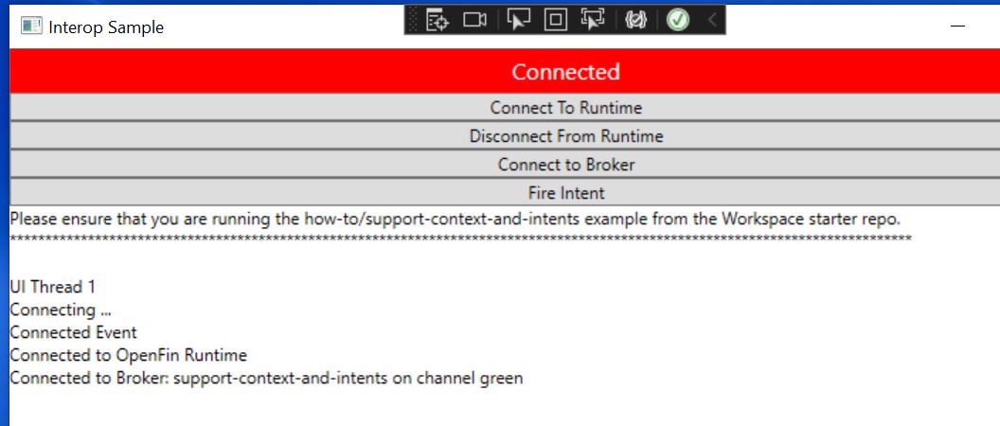
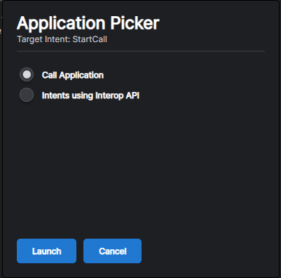
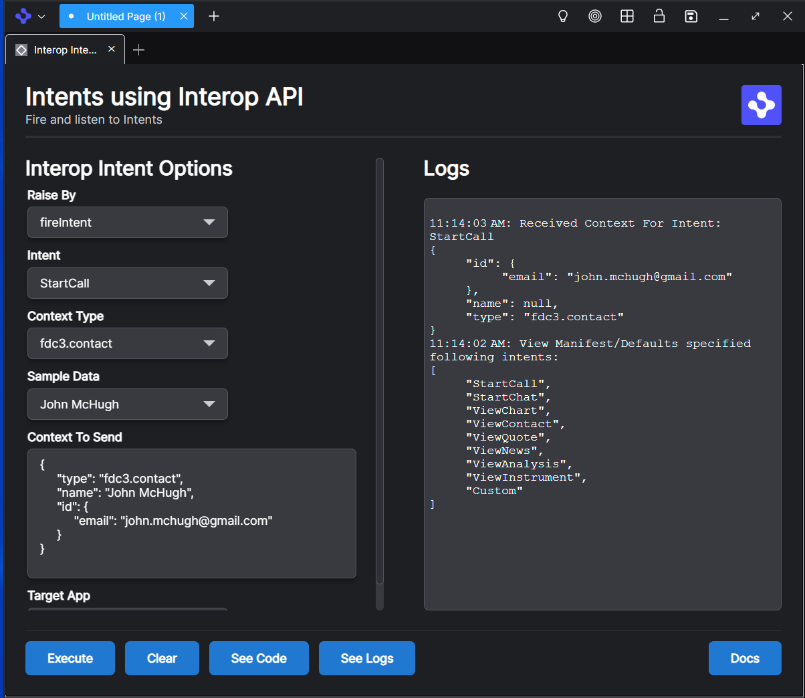

# Example of InterOp API communication between a Windows Native Application and OpenFin Workspace hosted Web Application
This is a simple example that shows how to use the InterOp API to fire intents that will be picked up and processed by the OpenFin Workspace InterOp Broker.

#### *Please note that it is very important that you are running the how-to/support-context-and-intents example from the Workspace starter repo prior to running this application.*

## How to run this example

1. Ensure that you have installed the following nuget packages:  
- OpenFin.Net.Adapter (minimum 29.2.0)  
2. Build the solution without errors

3. Run it from Visual Studio.  

4. Or navigate to the folder that has the executable (typically this will be in "how-to.v2\fire-intents\bin\Debug\net6.0-windows") and run the Interop.exe.  

5. Click on "Connect to Runtime". 

    Verify that you get the "Connected" message in the red box at the top.

6. Click on Connect to Broker". 

 

   Verify that you get a message "Connected to Broker: ...." in the area under the buttons. 

7. Click "Fire Intent". If your Workspace starter example (mentioned above) is running then you should see the following screen shot that is the intent picker  

  

8. Select "Intents using Interop API" and click "Launch". This will display the "Intent using Interop API" view from the workspace starter repo.  
  You should see the intent information that was sent from the Native application displayed in the log window on the right. 
  
  

9. Please remember to click "Disconnect from Runtime" once you have verified that the tests are working, and prior to closing the application window.